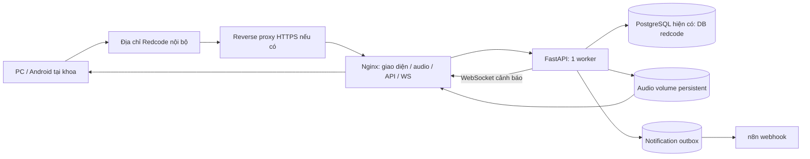
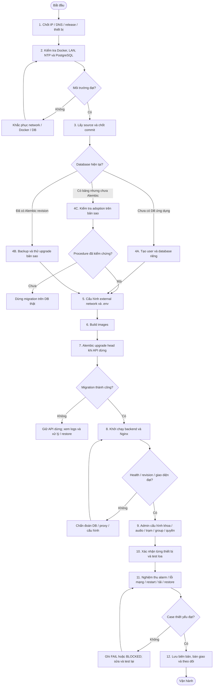
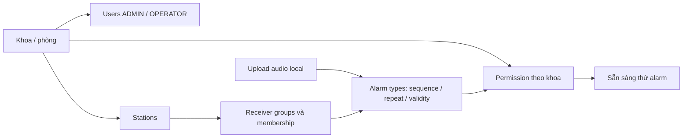
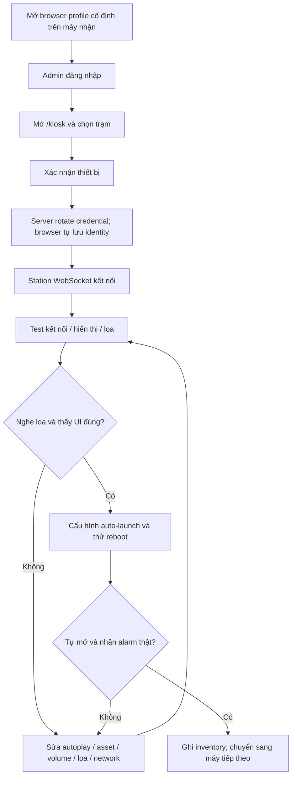
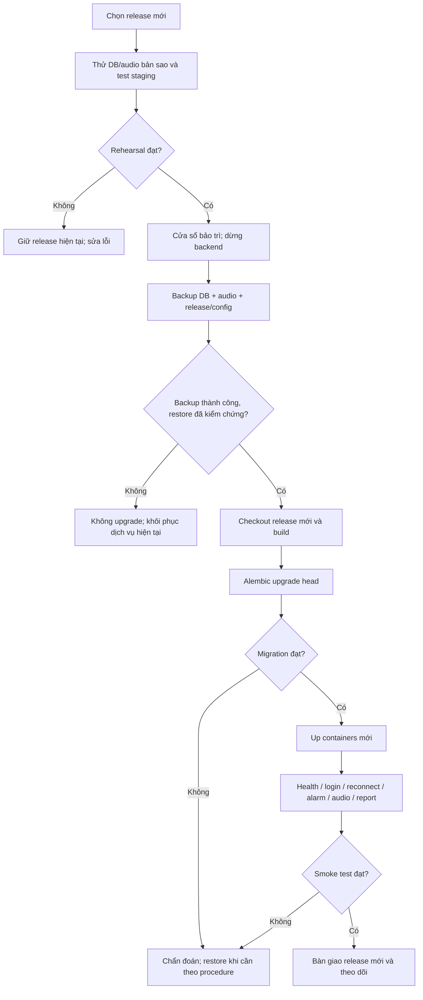
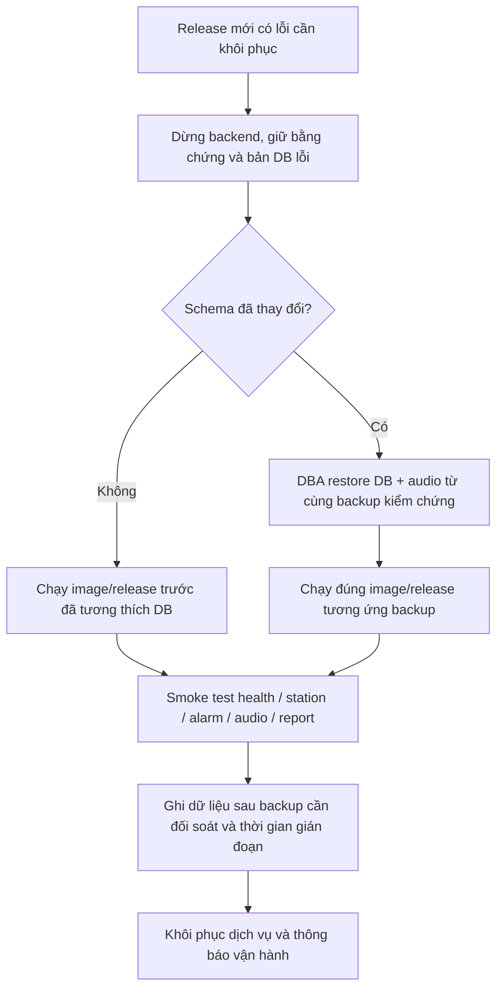

# REDCODE — Sơ đồ triển khai production từng bước

Tài liệu dành cho người trực tiếp triển khai tại bệnh viện. Tham chiếu code `9b01d4a`, migration head `20261007_permissions`.

**Luồng đơn giản mới:** có thể để DATABASE_URL trống → cài backend/Nginx → mở wizard → IT nhập PostgreSQL và mã setup → migrate/tạo Admin → cấu hình nghiệp vụ. n8n bỏ qua và bật sau tại `/admin/settings`; head mới `20261007_integrations`. Chi tiết tại đầu [runbook](production_deployment.md). External DB network/user vẫn chuẩn bị bởi IT.

- **Đọc sơ đồ và làm theo thứ tự trong tài liệu này.**
- Lệnh backup/restore và cấu hình đầy đủ: [Runbook production](production_deployment.md).
- Các bài nghiệm thu và mẫu biên bản: [Hướng dẫn kiểm thử](testing_guide.md).
- Các lệnh sử dụng **Bash trên Linux**, tại root repository trừ khi ghi khác. `<...>` là thông tin phải thay theo server thực tế.

## 1. Nhìn nhanh: đường đi của hệ thống



**Hiểu đơn giản:** người dùng chỉ mở địa chỉ Redcode; Nginx đưa giao diện và âm thanh tới browser, FastAPI xử lý nghiệp vụ, PostgreSQL giữ dữ liệu. n8n nhận thông báo qua outbox, không quyết định việc phát alarm.

Nếu dùng HTTP LAN trực tiếp, browser vào Nginx port 80, bỏ bước reverse proxy HTTPS. Compose hiện chưa có TLS; HTTPS phải được cấu hình ở lớp deployment.

## 2. Sơ đồ tổng thể: từ chuẩn bị đến vận hành



Nếu công cụ không hiển thị Mermaid, đọc theo chuỗi: **Chuẩn bị → DB → Cấu hình → Build → Migration → Startup → Nghiệp vụ → Thiết bị → Nghiệm thu → Bàn giao**.

## 3. Phiếu thông tin trước khi thao tác

Điền các giá trị này một lần, dùng nhất quán trong mọi bước:

| Thông tin | Giá trị tại bệnh viện |
|---|---|
| Release commit được chọn | `<commit>` |
| IP server / DNS Redcode | `<ip>` / `<dns>` |
| Origin browser truy cập | `http://<ip>` hoặc `https://<dns>` |
| PostgreSQL container/host | `<pg-container>` / `<pg-alias>` |
| External Docker network | `<pg-network>` |
| Database / application user | `redcode` / `<app-user>` |
| n8n URL hoặc tắt integration | `<url>` / để trống |
| Backup directory / kho secrets | `<backup-location>` |
| Máy thử đầu tiên | `<station-code>` / `<model-browser-loa>` |
| Người phụ trách DB / LAN / vận hành | `<names>` |

## 4. Các bước triển khai chi tiết

### Bước 1 — Chốt phạm vi và cửa sổ triển khai

**Thực hiện:** chọn release, địa chỉ truy cập, khoa/nhóm thử, danh sách trạm và người phụ trách. Nếu nâng cấp hệ thống đang dùng, chọn cửa sổ bảo trì và thông báo quy trình liên lạc thay thế.

**Kết quả cần có:** phiếu mục 3 đã điền, lịch triển khai và release xác định. Ghi rõ đây là fresh install hay upgrade.

### Bước 2 — Kiểm tra server, LAN và PostgreSQL

```bash
docker info
docker compose version
timedatectl status
docker network inspect <pg-network>
```

**Kiểm tra:** Docker server hoạt động; đồng hồ đồng bộ; backend sẽ truy cập được PostgreSQL alias qua network; PC/Android truy cập được server qua VLAN. Chuẩn bị disk, UPS, persistent DB/audio và nơi backup.

**Điều kiện qua bước:** Docker/network/DB sẵn sàng. Nếu Docker daemon không chạy hoặc DB không reachable, xử lý trước; build thành công không sửa được lỗi network.

### Bước 3 — Lấy source đúng release

```bash
git clone https://github.com/buinguyenhong/REDCODETHIENHANH.git
cd REDCODETHIENHANH
git checkout <release-commit>
git rev-parse HEAD
```

Nếu đã có checkout, kiểm tra `git status` trước khi đổi release để bảo toàn cấu hình deployment tại server. Máy offline dùng source/images được chuẩn bị từ môi trường build.

**Kết quả cần có:** hash release được ghi vào biên bản; source đầy đủ backend/frontend/nginx/migrations.

### Bước 4 — Chọn đúng đường database

| Tình trạng | Thao tác |
|---|---|
| Fresh install, chưa có DB Redcode | DBA tạo user + DB riêng trên PostgreSQL hiện có; xem SQL tại runbook mục 3 |
| DB Redcode đã quản lý bằng Alembic | Backup DB/audio; thử nâng cấp bản sao; dừng API khi migrate thật |
| DB có bảng từ create_all, chưa alembic_version | Inventory schema và chốt adoption procedure trên bản sao; không chạy initial create-tables, không stamp head tùy tiện |

**Điều kiện qua bước:** có DB đích đúng, credentials được lưu bảo mật, backup/procedure phù hợp tình trạng DB. Không tạo lại PostgreSQL production container.

### Bước 5 — Cấu hình network, origin và secrets

1. Trong `docker-compose.yml`, gắn backend vào external PostgreSQL network, khai báo đúng tên network như runbook mục 3.2.
2. Tạo `.env`:

```bash
cp .env.example .env
chmod 600 .env
```

3. Chỉnh ENVIRONMENT=production, DEMO_MODE=false, DATABASE_URL PostgreSQL, SECRET_KEY riêng ≥32 ký tự, origin cụ thể và INITIAL_ADMIN_PASSWORD cho fresh bootstrap.
4. DATABASE_URL dùng **PostgreSQL alias**, không localhost của backend; URL-encode password.
5. Nếu dùng HTTPS: cấu hình TLS/proxy `/ws` Upgrade và bảo vệ query credentials trong logs ở mọi proxy.

**Điều kiện qua bước:** `.env` không có credentials mẫu, origin khớp browser; external network tồn tại. Không lưu output chứa secret trong evidence.

### Bước 6 — Validate cấu hình và build images

```bash
docker compose config --quiet
docker compose build
```

**Kết quả cần có:** cả backend và Nginx image build thành công; frontend được build trong Nginx image. Nếu thiếu package/registry ở môi trường offline, dùng images đã chuẩn bị và kiểm tra đúng release.

### Bước 7 — Chạy migration trước mở dịch vụ

Với upgrade, chỉ thực hiện sau backup/upgrade rehearsal:

```bash
docker compose stop backend
docker compose run --rm --no-deps backend alembic upgrade head
```

**Kết quả cần có:** upgrade PASS đến revision release; với release tham chiếu là `20261007_permissions`. Giữ DB/history, normalized permission và legacy import đúng.

**Nếu FAIL:** giữ backend dừng, ghi lỗi migration, kiểm tra quyền/alias/schema. Xem nhánh phục hồi mục 7. Không dùng create_all/downgrade giả để vượt lỗi.

### Bước 8 — Khởi chạy và kiểm tra entrypoint

```bash
docker compose up -d
docker compose ps
docker compose exec -T backend alembic current
docker compose exec -T nginx nginx -t
curl --fail --silent --show-error http://127.0.0.1/api/health
docker compose logs --tail=100 backend nginx
```

Lệnh curl trên giả định Compose port 80 mặc định; nếu port/entrypoint đã đổi, dùng URL thực. Mở origin từ máy ở khoa và kiểm tra `/login`, `/kiosk`, local audio và WS.

**Điều kiện qua bước:** containers chạy, revision đúng, JSON database/status OK, giao diện qua Nginx mở được. n8n degraded được ghi riêng; không chặn core. HTTP 200 đơn thuần chưa chứng minh schema/loa/routing hoạt động.

### Bước 9 — Cấu hình nghiệp vụ theo thứ tự



1. Admin login → `/admin`; fresh production chỉ có Admin bootstrap.
2. Tạo khoa và users.
3. Tạo stations, groups và đúng membership; thiếu UI thao tác thì dùng API đã có trong `/api/docs`.
4. Upload audio, mở URL kiểm tra; file nhỏ hơn limit 20M kể cả multipart.
5. Cấu hình alarm types và quyền khoa. Kiểm tra group-in/out; type không group nhận toàn bộ stations enabled.
6. Chốt validity/repeat/interval với người vận hành; không dùng fixture ngắn của test làm mặc định production ngoài ý muốn.

**Kết quả cần có:** bảng mapping khoa → quyền alarm → nhóm → stations → audio được người vận hành xác nhận.

### Bước 10 — Xác nhận từng máy nhận



**Thực hiện trên máy nhận, không chỉ từ máy Admin:** chọn đúng station → xác nhận → logout Admin nếu chạy receiver độc lập → giữ nguyên profile/origin → launcher mở `/kiosk`.

**Kết quả cần có cho từng máy:** ONLINE, RTT có phản hồi, overlay test đúng, loa nghe thực, boot/refresh giữ identity. Xác nhận lại làm credential cũ bị thu hồi. READY trên browser không chứng minh loa không mute/rút dây.

### Bước 11 — Nghiệm thu trước bàn giao

Thực hiện T01–T13 trong [testing guide](testing_guide.md), tối thiểu:

1. Operator có quyền trigger; khoa không có quyền bị deny.
2. S1/S2 trong group nhận; S3 ngoài group không nhận.
3. Local dismiss S1 không tắt S2/global.
4. Global cancel/expire dừng đúng targets; giữ audit, không n8n end.
5. Mất mạng → missed ACTIVE sync; không replay cancelled/expired/dismissed.
6. Audio failure/retry và PC/Android unattended thật.
7. n8n down/core vẫn alarm; outbox retry/crash recovery.
8. Server/DB/container restart, tải real sockets qua entrypoint staging và backup restore drill.

**Điều kiện bàn giao:** có biên bản từng case, release/revision/evidence, không dùng mock/build thay kiểm chứng site. FAIL/BLOCKED cần owner và kế hoạch xử lý, không chuyển thành PASS chỉ vì service đã chạy.

### Bước 12 — Bàn giao và theo dõi vận hành

Lưu release/images, revision, topology/origin, inventory trạm, mapping/permissions/audio, backup/restore evidence, tài liệu và người trực. Secrets lưu riêng có kiểm soát truy cập. Theo dõi device offline, DB/disk, outbox backlog và backup định kỳ; lên lịch thử loa/restore theo quy trình bệnh viện.

## 5. Luồng nâng cấp hệ thống đang chạy



Không chạy migration song song với API đang phục vụ trong quy trình này. Sau đổi `.env`, recreate containers bằng `up -d`; restart đơn thuần không nạp env mới.

## 6. Luồng xử lý khi một bước thất bại

| Điểm lỗi | Dừng ở đâu | Kiểm tra trước | Tiếp tục khi |
|---|---|---|---|
| Docker/network/DB | Trước build/migration | Daemon, external network, alias, quyền DB | Backend có đường kết nối đúng |
| Build | Trước migration | Registry/package access, source/release | Cả images đúng release build PASS |
| Migration | Giữ backend dừng | Alembic logs, revision/schema/quyền | Fix hoặc restore đã kiểm chứng |
| Startup/502 | Trước cấu hình nghiệp vụ | Backend logs, revision, proxy/DNS | Health + UI + API qua Nginx đạt |
| Trạm không kết nối | Trước nghiệm thu trạm | Origin/profile, enabled/token rotation, WS Upgrade | ONLINE và PING/PONG đúng |
| Không nghe loa | Không đóng audio acceptance | Asset/autoplay/volume/mute/cáp loa | Nghe thực và retry/lifecycle đúng |
| Routing/FIFO/data lỗi | Trước bàn giao | Mapping/snapshot/queue/audit | Regression và test site lại PASS |

## 7. Sơ đồ rollback khi cần khôi phục



Schema forward-only: không `alembic downgrade`, không tự drop tables. Trước khi chạy release cũ trên schema chưa đổi, vẫn phải xác nhận compatibility. Restore DB/audio theo lệnh ở runbook mục 8–10; dữ liệu phát sinh sau backup phải được đối soát, không giả định tự giữ lại.

## 8. Checklist một trang cho người triển khai

- [ ] Chốt release/IP/DNS/origin/inventory và cửa sổ triển khai.
- [ ] Docker/LAN/NTP/PostgreSQL/network hoạt động.
- [ ] Fresh DB hoặc backup/adoption procedure đúng tình trạng.
- [ ] `.env` production riêng, không demo/wildcard/secret mẫu.
- [ ] External network + TLS/proxy WebSocket đúng.
- [ ] Build PASS; migrate PASS khi API dừng; revision đúng.
- [ ] Containers + JSON health + UI/API/WS qua Nginx đạt.
- [ ] Khoa/users/stations/groups/audio/types/permissions đúng mapping.
- [ ] Từng máy đã xác nhận, nghe loa thật, reboot/refresh/reconnect đạt.
- [ ] Local dismiss/global cancel/expiry/missed alarm/audio failure đạt.
- [ ] n8n/outbox/restart/load/report/migration/logs đã kiểm tra.
- [ ] Backup restore drill PASS, biên bản test và giới hạn được ghi.
- [ ] Bàn giao người trực, lịch monitoring/test loa/backup và quy trình sự cố.
